# 8x8 Array Multiplier
### Author: Evan Gilbert
### GitHub: e-tachyon

## Description
This repo contains the designs of the 8x8 multiplier. There is an HDL design in Verilog, a schematic design in Cadence, and a full layout design in Cadence.

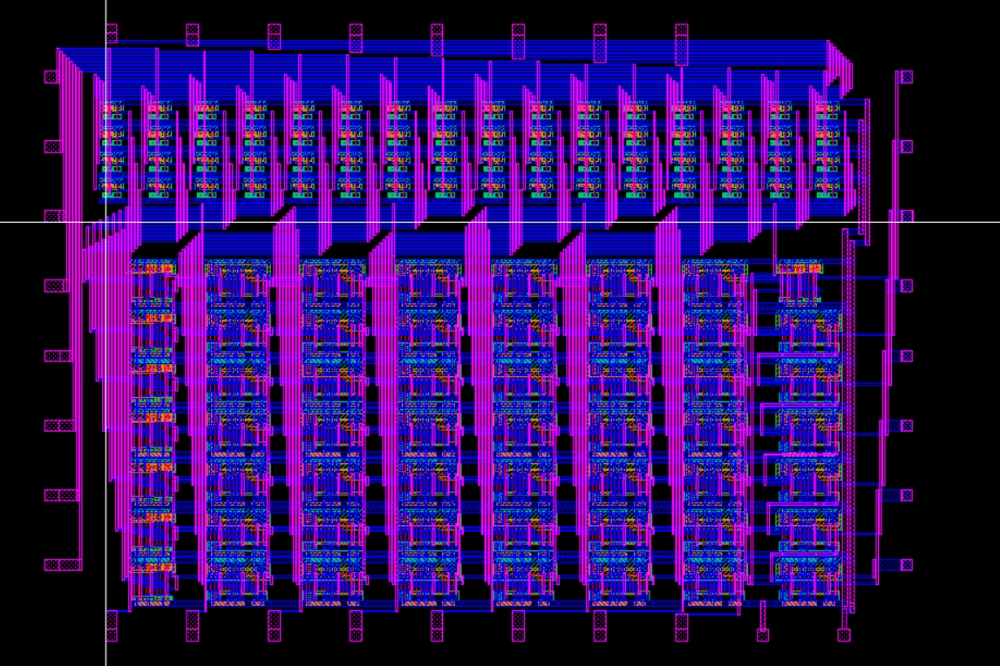
## HDL
The Verilog code contains lays out the architecture of the multiplier.
## Schematic
### AND2
My AND2 design is made from a basic NAND2 with an inverter.

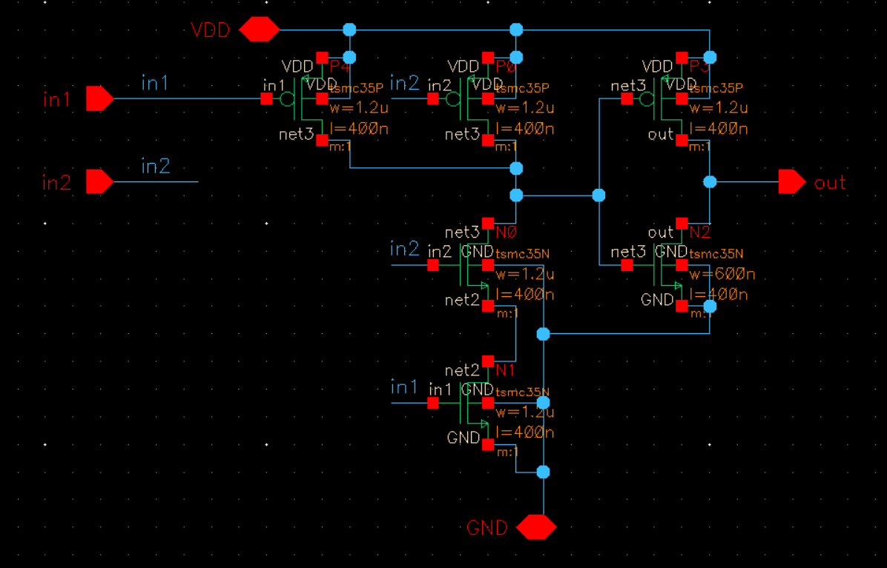
### Half Adder
My half adder consists of a AOI22 functioning as a XOR for the sum with a NOR2 for the carry. There is also 2 inverters for the inputs which help create the logic for my XOR and NOR gates.

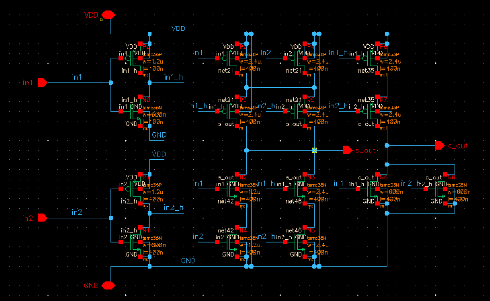
### Full Adder
The adder is based on the Zimmermann97 design for a mirror adder. I chose to use this design since it cut down on the transistor count over a traditional design which lowers my overall area.

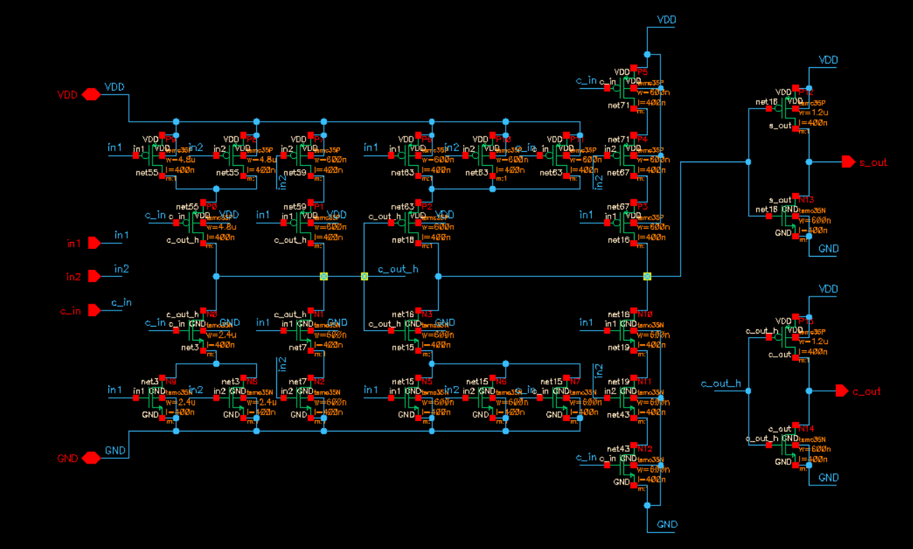
### 8x8 Multiplier
Array based multplier design.

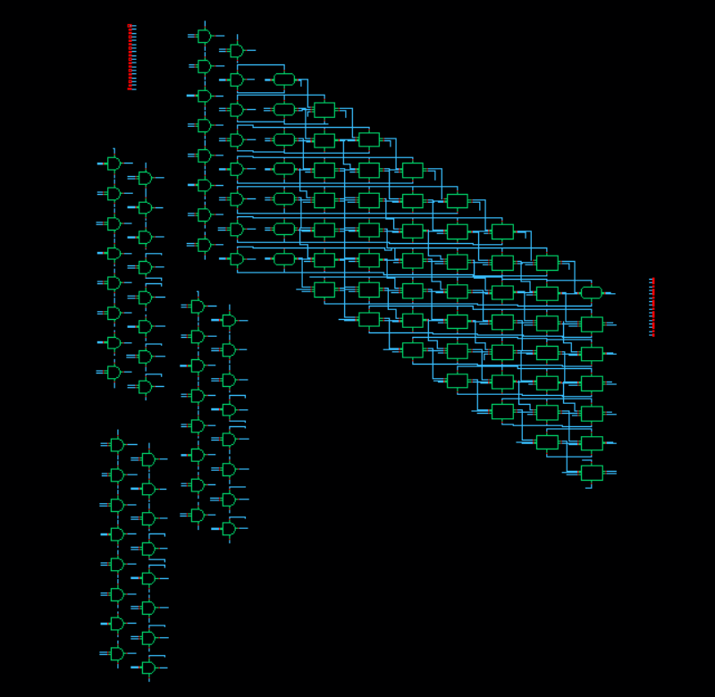
## Layout
### AND2

### Half Adder
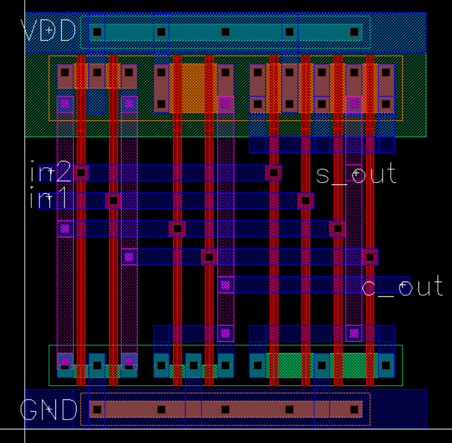
### Full Adder
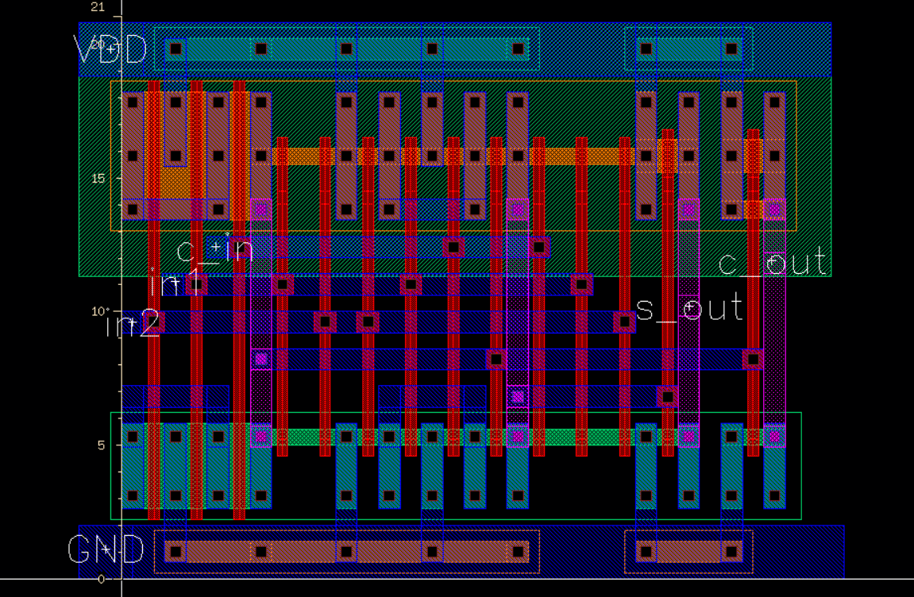
### 8x8 Multiplier

## Simulations
### AND2
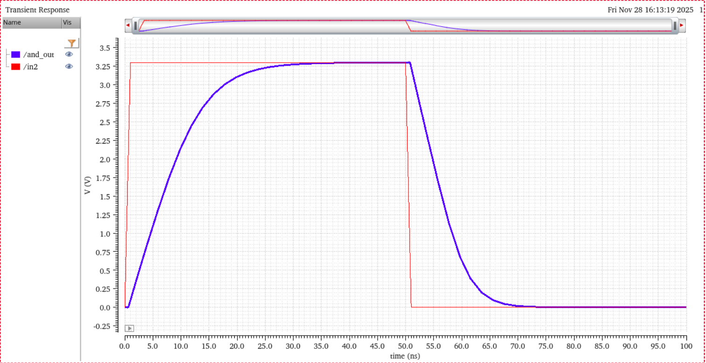
### Half Adder
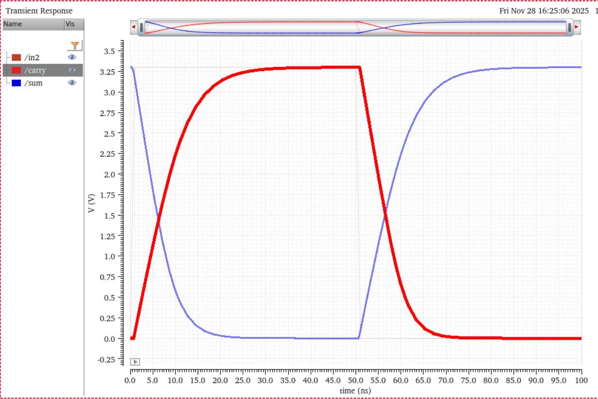
### Full Adder
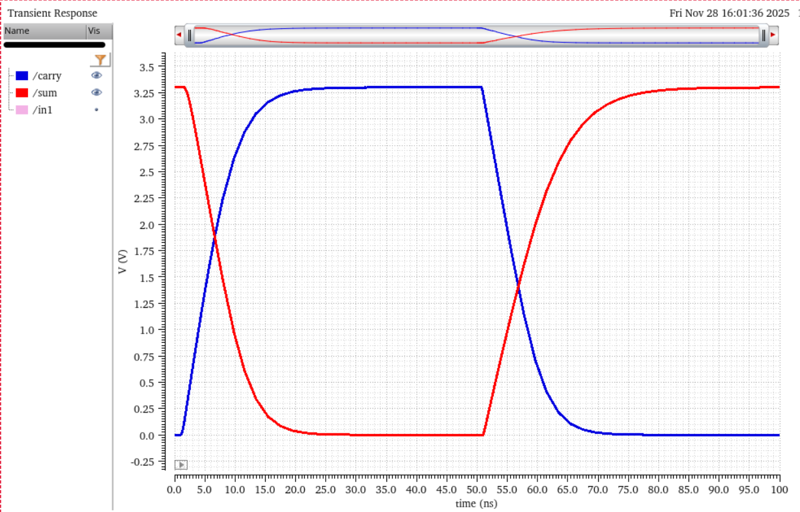
## LVS
Design Passed LVS.

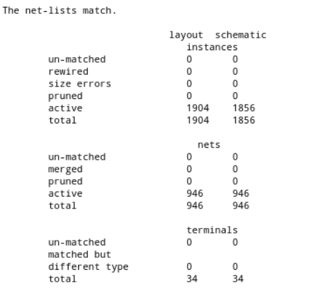

